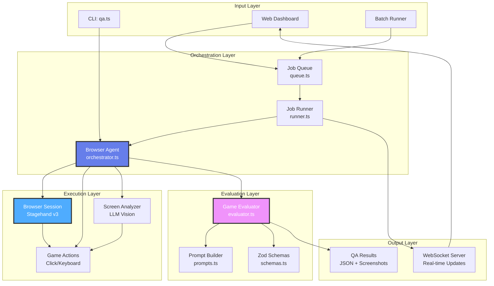
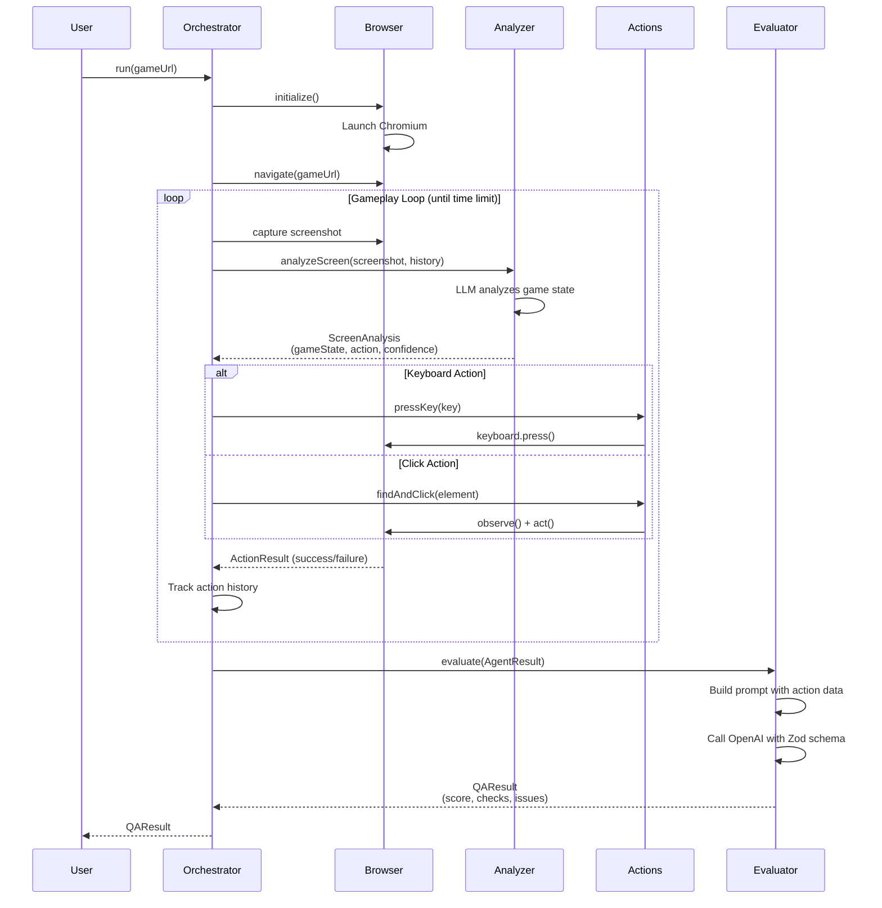
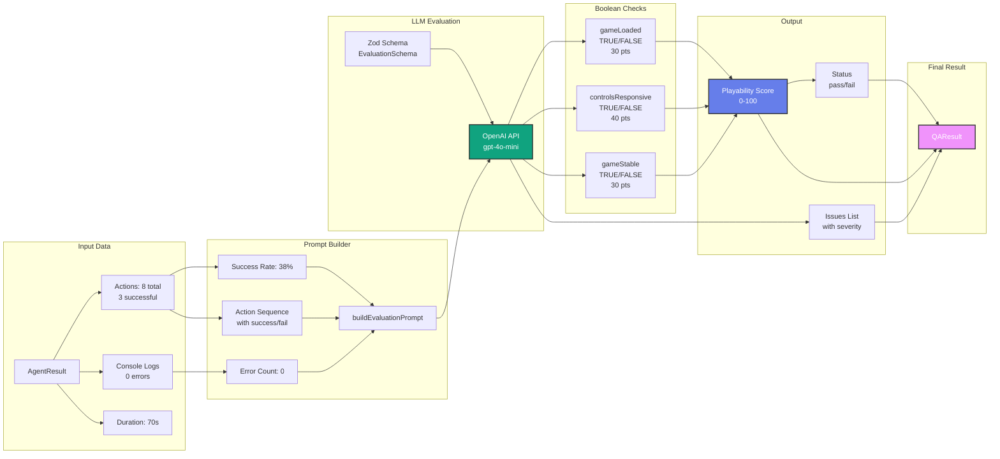
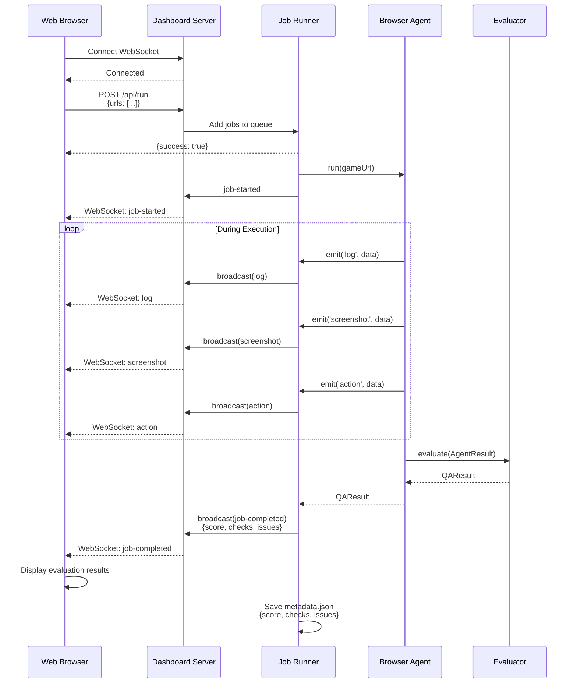
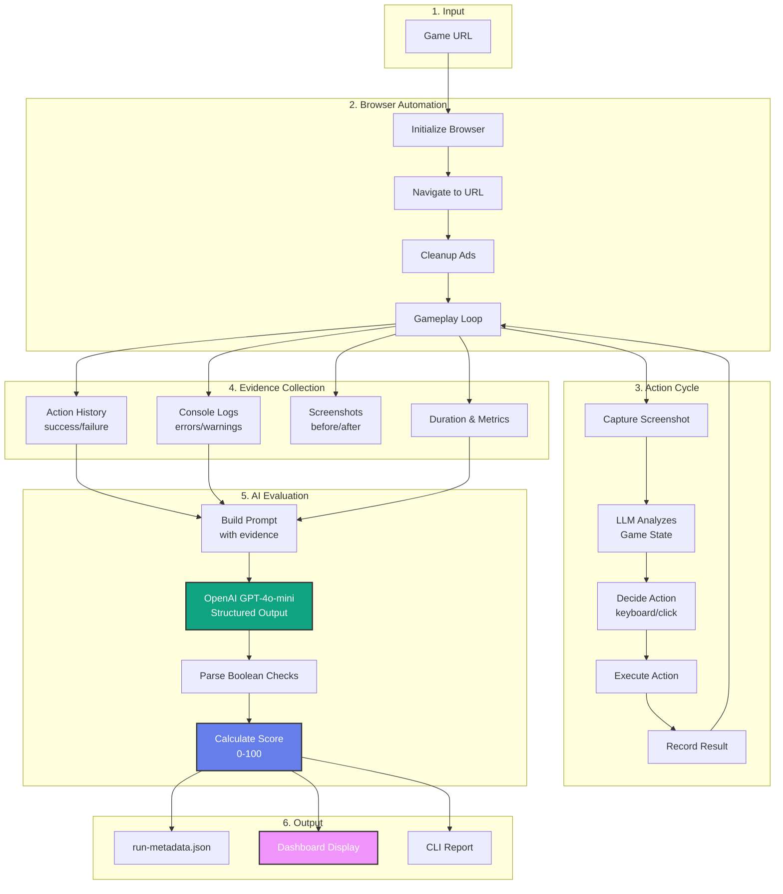
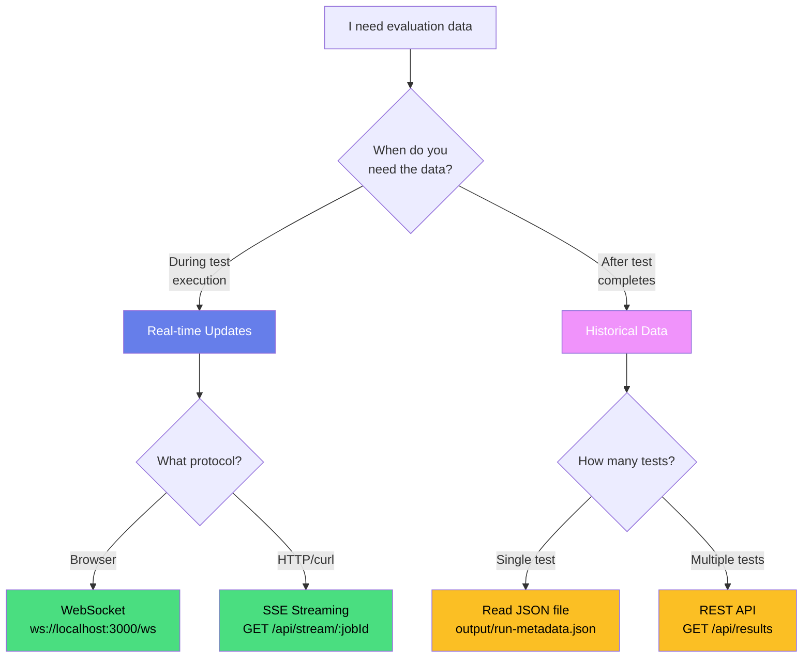
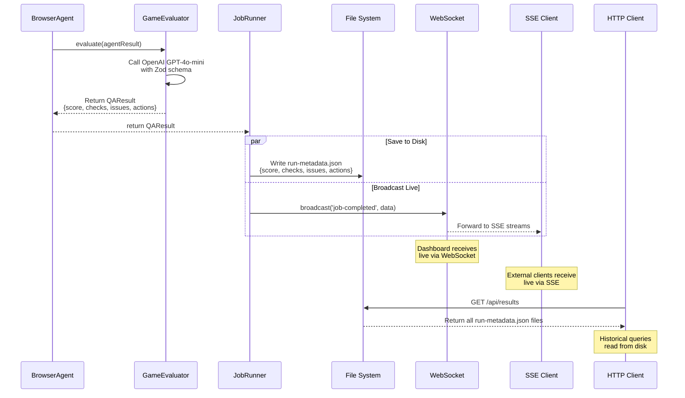

# Game Autoplay QA Agent

An AI-powered autonomous testing system for web-based games. Uses browser automation with LLM-driven decision making to play games, capture evidence, and evaluate playability.

## Features

- **Autonomous Game Playing**: AI agent analyzes screens and makes intelligent decisions
- **Canvas & DOM Game Support**: Handles both canvas-rendered and DOM-based games
- **AI Evaluation System**: GPT-4 powered playability scoring with boolean checks
- **Visual Evidence**: Before/after screenshots for every action
- **Real-time Dashboard**: WebSocket-powered live monitoring
- **SSE Streaming API**: Real-time event streaming for external clients
- **Batch Testing**: Parallel execution of multiple game tests
- **Structured Results**: JSON reports with scores, checks, and issues
- **Multiple Access Methods**: REST API, SSE streams, WebSocket, or direct file access - [see guide](#how-to-get-evaluation-results-1)

## Architecture

### System Overview



### Agent Execution Flow



### Evaluation Pipeline



### Dashboard Communication Flow



### Data Flow



## Agent Stopping Conditions

The agent runs **unlimited actions** until one of these conditions is met:

| Condition | Description | Config |
|-----------|-------------|--------|
| **Time Limit** | Primary stopping condition | `MAX_EXECUTION_TIME_MS=30000` (30s) |
| **Browser Crash** | Unrecoverable browser error | N/A (automatic) |
| **Game Unstable** | Too many consecutive failures | N/A (automatic) |

**Key Design:** No action count limit - the agent takes as many actions as needed within the time window.

## Quick Start

### Prerequisites

- [Bun](https://bun.sh/) runtime (v1.0+)
- [OpenAI](https://openai.com/) API key

### Installation

```bash
# Clone repository
git clone <repository-url>
cd game-autoplay

# Install dependencies
bun install

# Configure environment
cp .env.example .env
# Edit .env and add your OPENAI_API_KEY
```

### Configuration

Required environment variables:
```bash
OPENAI_API_KEY=your_api_key_here
```

Optional configuration:
```bash
# Browser mode (LOCAL or BROWSERBASE)
BROWSER_MODE=LOCAL

# Execution limits
MAX_EXECUTION_TIME_MS=30000  # 30 seconds (primary stopping condition)
MAX_ACTIONS=999999           # Effectively unlimited (not enforced)

# Model configuration
MODEL_NAME=gpt-4o-mini       # or gpt-4o, claude-3-5-sonnet, etc.
```

## Usage

### CLI Mode (Single Game Test)

```bash
# Test a single game
bun qa.ts https://playtictactoe.org

# Output:
# === EVALUATION RESULTS ===
# Status: PASS
# Playability Score: 60/100
#
# Checks:
#   [PASS] Game Loaded (30pts): PASS
#   [FAIL] Controls Responsive (40pts): FAIL
#   [PASS] Game Stable (30pts): PASS
```

### Dashboard Mode (Multiple Games + Live Monitoring)

```bash
# Start dashboard server
bun server.ts

# Open browser to http://localhost:3000
# - Enter multiple URLs (one per line)
# - Click "Run Tests"
# - Watch real-time progress with live logs and screenshots
# - View evaluation results when complete
```

### API Mode (SSE Streaming)

The server provides a **Server-Sent Events (SSE) API** for real-time streaming to external clients.

#### 1. Submit Test Job

```bash
# Submit game for testing
curl -X POST https://your-server.com/api/run \
  -H "Content-Type: application/json" \
  -d '{"urls": ["https://playtictactoe.org"]}'

# Response:
# {"success": true, "jobs": [{"id": "abc-123", ...}]}
```

#### 2. Stream Real-time Updates

```bash
# Stream test progress via SSE
curl -N https://your-server.com/api/stream/abc-123

# Output (real-time):
# event: connected
# data: {"clientId":"...","jobId":"abc-123"}
#
# event: log
# data: {"message":"Analyzing screen..."}
#
# event: action
# data: {"action":"click start","success":true}
#
# event: job-completed
# data: {"status":"pass","playabilityScore":100,...}
```

#### 3. Example with JavaScript

```javascript
// Submit job
const response = await fetch('https://your-server.com/api/run', {
  method: 'POST',
  headers: { 'Content-Type': 'application/json' },
  body: JSON.stringify({ urls: ['https://playtictactoe.org'] }),
});
const { jobs } = await response.json();
const jobId = jobs[0].id;

// Stream events
const streamResponse = await fetch(`https://your-server.com/api/stream/${jobId}`);
const reader = streamResponse.body.getReader();
const decoder = new TextDecoder();

let buffer = '';
while (true) {
  const { done, value } = await reader.read();
  if (done) break;
  
  buffer += decoder.decode(value);
  const messages = buffer.split('\n\n');
  buffer = messages.pop();
  
  for (const message of messages) {
    // Parse SSE format: "event: type\ndata: json"
    const [eventLine, dataLine] = message.split('\n');
    if (eventLine?.startsWith('event: ') && dataLine?.startsWith('data: ')) {
      const eventType = eventLine.substring(7);
      const data = JSON.parse(dataLine.substring(6));
      console.log(eventType, data);
    }
  }
}
```

#### 4. Test Scripts

```bash
# Test SSE endpoint with provided scripts
bun test-sse.js https://playtictactoe.org  # JavaScript
./test-sse.sh https://playtictactoe.org    # Bash/curl
```

**API Documentation:** See [`docs/SSE_API.md`](docs/SSE_API.md) for complete reference.

---

## How to Get Evaluation Results

The agent provides **evaluation data** (scores, checks, issues, actions) in multiple ways depending on your needs.

### Decision Tree: Which Endpoint Should I Use?



### Data Flow: From Evaluator to Your Application



### Comparison: SSE vs REST vs WebSocket vs File

| Feature | SSE Stream | REST API | WebSocket | JSON File |
|---------|-----------|----------|-----------|-----------|
| **Endpoint** | `GET /api/stream/:jobId` | `GET /api/results` | `ws://localhost:3000/ws` | `output/*/run-metadata.json` |
| **Protocol** | Server-Sent Events | HTTP/JSON | WebSocket | File I/O |
| **Timing** | Real-time stream | After completion | Real-time bidirectional | After completion |
| **Format** | SSE (event/data pairs) | JSON array | JSON messages | JSON object |
| **Use Case** | External monitoring | Batch queries | Dashboard UI | Direct file access |
| **Evaluation Data** | Last event (`job-completed`) | All runs in `runs[]` | Event: `job-completed` | Root object |
| **Action History** | Individual events | In `actions[]` array | Individual events | In `actions[]` array |
| **curl Support** | Yes: `curl -N` | Yes: `curl` | No: Needs WebSocket client | Yes: Read file |
| **Browser Support** | Yes: EventSource API | Yes: fetch() | Yes: WebSocket API | No: N/A |
| **Best For** | CLI tools, scripts | Analytics, reports | Live dashboards | Local processing |

### Example: Getting Evaluation Data Each Way

#### 1. SSE Stream (Real-time)

**When:** You want live updates as the test runs

```bash
# Submit test
RESPONSE=$(curl -s -X POST http://localhost:3000/api/run \
  -H "Content-Type: application/json" \
  -d '{"urls":["https://playtictactoe.org"]}')

JOB_ID=$(echo $RESPONSE | grep -o '"id":"[^"]*"' | head -1 | sed 's/"id":"\(.*\)"/\1/')

# Stream events (real-time)
curl -N http://localhost:3000/api/stream/$JOB_ID
```

**Output:**
```
event: connected
data: {"clientId":"xyz","jobId":"abc-123"}

event: log
data: {"message":"Starting browser..."}

event: action
data: {"count":1,"action":"click start","success":true}

event: job-completed
data: {"status":"pass","playabilityScore":70,"checks":{"gameLoaded":true,"controlsResponsive":true,"gameStable":false},"issues":[{"severity":"major","description":"Console errors"}],"actionCount":8}
```

**Extract just the evaluation:**
```bash
curl -N -s "http://localhost:3000/api/stream/$JOB_ID" | \
  awk '/^event: job-completed$/{ getline; sub(/^data: /, ""); print }' | \
  jq '{status, playabilityScore, checks}'
```

#### 2. REST API (Historical)

**When:** You need results after test completes or want multiple results

```bash
# Get all completed test results
curl http://localhost:3000/api/results | jq '.runs[0]'
```

**Output:**
```json
{
  "jobId": "abc-123",
  "url": "https://playtictactoe.org",
  "status": "pass",
  "playabilityScore": 70,
  "checks": {
    "gameLoaded": true,
    "controlsResponsive": true,
    "gameStable": false
  },
  "issues": [
    {
      "severity": "major",
      "description": "Console errors detected"
    }
  ],
  "actions": [
    {"action": "click start", "success": true},
    {"action": "click cell", "success": true}
  ],
  "actionCount": 8,
  "successfulActions": 6
}
```

#### 3. WebSocket (Dashboard)

**When:** Building a web dashboard with live updates

```javascript
const ws = new WebSocket('ws://localhost:3000/ws');

ws.onmessage = (event) => {
  const message = JSON.parse(event.data);
  
  if (message.type === 'job-completed') {
    console.log('Evaluation:', message.data);
    // {
    //   status: 'pass',
    //   playabilityScore: 70,
    //   checks: {...},
    //   issues: [...]
    // }
  }
};

// Submit test
fetch('/api/run', {
  method: 'POST',
  headers: { 'Content-Type': 'application/json' },
  body: JSON.stringify({ urls: ['https://playtictactoe.org'] })
});
```

#### 4. JSON File (Direct Access)

**When:** Processing locally or accessing specific test results

```bash
# Find most recent test
LATEST=$(ls -t output/*/run-metadata.json | head -1)

# Read evaluation data
cat $LATEST | jq '{status, playabilityScore, checks, issues, actions}'
```

**Output:**
```json
{
  "status": "pass",
  "playabilityScore": 70,
  "checks": {
    "gameLoaded": true,
    "controlsResponsive": true,
    "gameStable": false
  },
  "issues": [
    {
      "severity": "major",
      "description": "Console errors detected",
      "evidence": "2 errors in console"
    }
  ],
  "actions": [
    {
      "action": "click the start button",
      "success": true,
      "timestamp": "2025-11-10T12:34:56.789Z"
    },
    {
      "action": "click top-left cell",
      "success": true,
      "timestamp": "2025-11-10T12:34:58.123Z"
    }
  ]
}
```

### Quick Reference: Evaluation Data Structure

All endpoints return the same `QAResult` structure:

```typescript
interface QAResult {
  gameUrl: string;
  status: 'pass' | 'fail';        // ≥50 = pass
  playabilityScore: number;        // 0-100
  
  // Boolean checks (determine score)
  checks: {
    gameLoaded: boolean;           // 30 points
    controlsResponsive: boolean;   // 40 points
    gameStable: boolean;           // 30 points
  };
  
  // Issues found during testing
  issues: Array<{
    severity: 'critical' | 'major' | 'minor';
    description: string;
    evidence?: string;
  }>;
  
  // Detailed action history
  actions: Array<{
    action: string;                // e.g., "click start button"
    success: boolean;
    timestamp: Date;
    error?: string;
    screenshotBefore?: string;
    screenshotAfter?: string;
  }>;
  
  // Metadata
  duration: number;                // milliseconds
  timestamp: Date;
  screenshots: string[];
  metadata: {
    actionCount: number;
    successfulActions: number;
    consoleErrors: number;
  };
}
```

### Common Patterns

#### Pattern 1: Submit test and wait for result

```bash
# Submit test
JOB_ID=$(curl -s -X POST http://localhost:3000/api/run \
  -H "Content-Type: application/json" \
  -d '{"urls":["https://playtictactoe.org"]}' | jq -r '.jobs[0].id')

# Stream and extract final evaluation
curl -N -s "http://localhost:3000/api/stream/$JOB_ID" | \
  awk '/^event: job-completed$/{ getline; sub(/^data: /, ""); print }' | \
  jq '.'
```

#### Pattern 2: Poll for completion

```bash
# Poll REST API until test completes
JOB_ID="abc-123"

while true; do
  RESULT=$(curl -s http://localhost:3000/api/results | \
    jq ".runs[] | select(.jobId == \"$JOB_ID\")")
  
  if [ -n "$RESULT" ]; then
    echo "$RESULT" | jq '{status, playabilityScore, checks}'
    break
  fi
  
  sleep 2
done
```

#### Pattern 3: Batch analysis

```bash
# Analyze all test results
curl -s http://localhost:3000/api/results | \
  jq '.runs[] | {
    url,
    score: .playabilityScore,
    passed: (.status == "pass"),
    issues: (.issues | length)
  }'
```

**Output:**
```json
{"url": "https://game1.com", "score": 100, "passed": true, "issues": 0}
{"url": "https://game2.com", "score": 70, "passed": true, "issues": 1}
{"url": "https://game3.com", "score": 30, "passed": false, "issues": 3}
```

---

### Programmatic Usage

```typescript
import { BrowserAgent } from './src/agent/orchestrator.js';
import { loadConfig } from './src/config/index.js';

const config = loadConfig();
const agent = new BrowserAgent(config);

const result = await agent.run('https://playtictactoe.org');

console.log(`Status: ${result.status}`);
console.log(`Score: ${result.playabilityScore}/100`);
console.log(`Checks:`, result.checks);
console.log(`Issues:`, result.issues);
```

## How to Get Evaluation Results

*Complete guide with decision trees, diagrams, and examples - see [How to Get Evaluation Results](#how-to-get-evaluation-results-1)*

## Project Structure

```
.
├── src/
│   ├── agent/              # Browser automation
│   │   ├── orchestrator.ts    # Main agent loop
│   │   ├── browser.ts         # Stagehand session management
│   │   ├── actions.ts         # Game actions (click, keyboard)
│   │   └── screen-analyzer.ts # LLM screen analysis
│   │
│   ├── evaluation/         # AI evaluation system
│   │   ├── evaluator.ts       # Game evaluator class
│   │   ├── prompts.ts         # Prompt builder
│   │   └── schemas.ts         # Zod schemas
│   │
│   ├── server/             # Dashboard server
│   │   ├── index.ts           # HTTP + WebSocket server
│   │   ├── runner.ts          # Job runner
│   │   └── queue.ts           # Job queue
│   │
│   ├── config/             # Configuration
│   │   └── index.ts           # Config loader
│   │
│   ├── types/              # TypeScript types
│   │   └── index.ts           # Shared interfaces
│   │
│   └── utils/              # Utilities
│       ├── logger.ts          # Winston logger
│       ├── errors.ts          # Custom errors
│       └── validation.ts      # Zod validators
│
├── public/                 # Dashboard UI
│   ├── index.html            # Main HTML
│   ├── app.js                # Frontend logic
│   └── styles.css            # Styles
│
├── qa.ts                   # CLI entry point
├── server.ts               # Server entry point
└── README.md              # This file
```

## How It Works

### 1. Browser Automation (Stagehand v3)

The agent uses [Stagehand](https://github.com/browserbase/stagehand) v3 for AI-powered browser automation:

- **`act()`**: Execute actions (click, type) using natural language
- **`extract()`**: Extract structured data from pages using LLM
- **`observe()`**: Find elements before acting on them
- Direct Playwright access for keyboard controls

### 2. LLM-Driven Gameplay

The `ScreenAnalyzer` uses GPT-4o-mini to:
1. Analyze game screenshots and DOM structure
2. Determine current game state (menu, playing, game_over)
3. Recommend next action based on game type and history
4. Adapt strategy based on previous successes/failures

**Game Detection Logic:**
- **Canvas games**: Prioritize keyboard controls (arrow keys, WASD)
- **DOM games**: Click on specific elements in accessibility tree
- **Hybrid games**: Combine both strategies

### 3. AI Evaluation System

After gameplay, the evaluator analyzes results using **boolean checks**:

| Check | Weight | Criteria |
|-------|--------|----------|
| **Game Loaded** | 30 pts | Success rate > 0% (at least one action worked) |
| **Controls Responsive** | 40 pts | Success rate ≥ 50% (majority of actions worked) |
| **Game Stable** | 30 pts | Execution completed AND no console errors |

**Score Calculation:**
```
Score = (gameLoaded ? 30 : 0) + 
        (controlsResponsive ? 40 : 0) + 
        (gameStable ? 30 : 0)

Pass: Score ≥ 50
Fail: Score < 50
```

**Fallback**: If OpenAI API is unavailable, uses deterministic heuristics with same logic.

### 4. Evidence Collection

Every test produces:
- Action history with success/failure
- Before/after screenshots for each action
- Console logs (errors, warnings)
- Execution metrics (duration, counts)
- JSON metadata file with all data

### 5. Real-time Monitoring

Dashboard provides:
- Live logs streamed via WebSocket
- Screenshots appear in real-time
- Progress bars and action counters
- Evaluation results displayed immediately
- Score visualization with color coding

## Evaluation Scoring

### Score Ranges

| Score | Status | Meaning |
|-------|--------|---------|
| **100** | PASS | Perfect - All checks pass |
| **70** | PASS | Good - 2/3 checks pass |
| **60** | PASS | Acceptable - Game loaded + stable OR loaded + responsive |
| **40** | FAIL | Poor - Only controls responsive |
| **30** | FAIL | Poor - Only game loaded |
| **0** | FAIL | Broken - All checks fail |

### Example Results

**Successful Game (Score: 100)**
```json
{
  "status": "pass",
  "playabilityScore": 100,
  "checks": {
    "gameLoaded": true,
    "controlsResponsive": true,
    "gameStable": true
  },
  "issues": []
}
```

**Problematic Game (Score: 30)**
```json
{
  "status": "fail",
  "playabilityScore": 30,
  "checks": {
    "gameLoaded": true,
    "controlsResponsive": false,
    "gameStable": false
  },
  "issues": [
    {
      "severity": "major",
      "description": "Controls unresponsive - success rate below 50%",
      "evidence": "Only 2/10 actions succeeded"
    }
  ]
}
```

## Testing Strategy

### Best Practices

1. **Start with simple games**: Tic-tac-toe, Snake, 2048
2. **Use LOCAL mode** for debugging (see browser in real-time)
3. **Use BROWSERBASE mode** for production (faster, no local Chrome needed)
4. **Batch test** similar games to compare playability
5. **Review screenshots** to understand action failures

### Common Issues

| Issue | Cause | Solution |
|-------|-------|----------|
| All actions fail | Game not loaded | Increase wait time, check URL |
| Canvas game not responding | Using click instead of keyboard | Agent auto-detects, but verify game type |
| Low success rate | Wrong game type detection | Review action history, adjust strategy |
| Evaluation fails | OpenAI API error | Check API key, uses fallback automatically |

## Advanced Configuration

### Custom Models

```typescript
// In .env or config
MODEL_NAME=anthropic/claude-3-5-sonnet-20241022
```

Supported models:
- `gpt-4o-mini` (default, cheap, fast)
- `gpt-4o` (better accuracy, more expensive)
- `anthropic/claude-3-5-sonnet-20241022` (alternative LLM)
- Any OpenRouter compatible model

### Browser Modes

**LOCAL** (default):
- Uses local Chrome/Chromium
- Visible browser (headless: false by default)
- Good for debugging
- Requires Chrome installed

**BROWSERBASE**:
- Cloud browser service
- Headless by default
- Faster startup
- No local dependencies
- Requires Browserbase account

### Parallel Execution Limits

```typescript
// In config
maxConcurrentJobs: {
  LOCAL: 2,        // Max 2 local browsers at once
  BROWSERBASE: 5   // Max 5 cloud browsers at once
}
```

## Output Files

Each test creates a timestamped directory:

```
output/
└── playtictactoe-org_2025-11-08_053157/
    ├── run-metadata.json      # Complete results
    ├── action-1-before.png    # Screenshot before action 1
    ├── action-1-after.png     # Screenshot after action 1
    ├── action-2-before.png
    ├── action-2-after.png
    └── ...
```

**`run-metadata.json` structure:**
```json
{
  "jobId": "abc123",
  "url": "https://playtictactoe.org",
  "status": "pass",
  "playabilityScore": 60,
  "checks": {
    "gameLoaded": true,
    "controlsResponsive": false,
    "gameStable": true
  },
  "issues": [...],
  "duration": 70423,
  "actionCount": 8,
  "successfulActions": 3,
  "consoleErrors": 0,
  "screenshots": [...],
  "timestamp": "2025-11-08T05:31:57.000Z"
}
```

## Deployment

### Deploy to Fly.io

```bash
# Install Fly CLI
curl -L https://fly.io/install.sh | sh

# Login to Fly
fly auth login

# Deploy (first time)
fly launch

# Deploy updates
fly deploy

# View logs
fly logs

# Your API will be available at:
# https://your-app.fly.dev/api/run
# https://your-app.fly.dev/api/stream/:jobId
```

### Environment Variables (Production)

Set these in your deployment platform:

```bash
OPENAI_API_KEY=sk-...           # Required for LLM
BROWSER_MODE=BROWSERBASE         # Use cloud browsers
BROWSERBASE_API_KEY=...          # If using Browserbase
BROWSERBASE_PROJECT_ID=...       # If using Browserbase
MAX_EXECUTION_TIME_MS=60000      # 60s for production
HEADLESS=true                    # Run headless in production
```

### API Endpoints

Once deployed, your API will be available at:

| Endpoint | Method | Purpose |
|----------|--------|---------|
| `/api/run` | POST | Submit test jobs |
| `/api/stream/:jobId` | GET | Stream job events (SSE) |
| `/api/status` | GET | Queue statistics |
| `/api/results` | GET | Historical test results |
| `/` | GET | Dashboard UI |

**Example:**
```bash
# Submit test to production
curl -X POST https://your-app.fly.dev/api/run \
  -H "Content-Type: application/json" \
  -d '{"urls": ["https://playtictactoe.org"]}'

# Stream results
curl -N https://your-app.fly.dev/api/stream/JOB_ID
```

## Roadmap

- [x] Phase 1: Project Setup
- [x] Phase 2: Browser Agent (Stagehand v3)
- [x] Phase 3: AI Evaluation
- [x] Phase 4: Web Dashboard
- [x] Phase 5: Parallel Execution
- [x] Phase 6: SSE Streaming API
- [ ] Phase 7: GIF Recording
- [ ] Phase 8: Batch Testing CLI
- [ ] Phase 9: Advanced Metrics (performance, accessibility)

## Contributing

Contributions welcome! Key areas:
- Additional game type detection strategies
- New evaluation metrics
- Dashboard UI improvements
- Documentation and examples

## License

MIT

## Acknowledgments

- [Stagehand](https://github.com/browserbase/stagehand) - AI-powered browser automation
- [Browserbase](https://browserbase.com) - Cloud browser infrastructure
- [OpenAI](https://openai.com) - GPT models for analysis and evaluation
- [Bun](https://bun.sh) - Fast JavaScript runtime

---

**Built for automated game testing**
