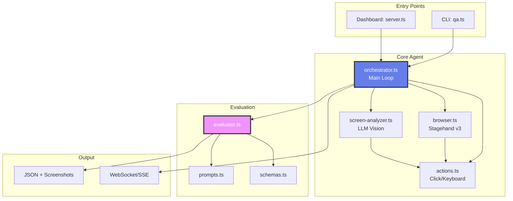
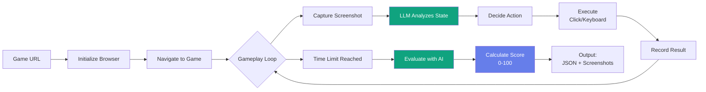

# Game Autoplay QA Agent

An AI-powered autonomous testing system for web-based games. Uses browser automation with LLM-driven decision making to play games, capture evidence, and evaluate playability.

## Features

- **Autonomous Game Playing**: AI agent analyzes screens and makes intelligent decisions
- **Canvas & DOM Game Support**: Handles both canvas-rendered and DOM-based games
- **AI Evaluation System**: GPT-4 powered playability scoring with boolean checks
- **Real-time Dashboard**: WebSocket-powered live monitoring
- **SSE Streaming API**: Real-time event streaming for external clients
- **Structured Results**: JSON reports with scores, checks, and screenshots

## Architecture



## How It Works



**Agent stops when**: Time limit reached (default 30s) OR browser crashes OR too many consecutive failures

**Evaluation**: Boolean checks calculate score
- Game Loaded (30pts): At least one action succeeded
- Controls Responsive (40pts): ≥50% success rate
- Game Stable (30pts): No console errors + completed execution

## Quick Start

### Prerequisites

- [Bun](https://bun.sh/) runtime (v1.0+)
- [OpenAI](https://openai.com/) API key

### Installation

```bash
# Clone repository
git clone <repository-url>
cd game-autoplay

# Install dependencies
bun install

# Configure environment
cp .env.example .env
# Edit .env and add your OPENAI_API_KEY
```

### Environment Setup

Create `.env` file:
```bash
OPENAI_API_KEY=your_api_key_here
```

## Usage

### 1. CLI Mode (Single Test)

```bash
bun qa.ts https://playtictactoe.org
```

Output:
```
=== EVALUATION RESULTS ===
Status: PASS
Playability Score: 60/100

Checks:
  ✓ Game Loaded (30pts)
  ✗ Controls Responsive (40pts)  
  ✓ Game Stable (30pts)
```

### 2. Dashboard Mode (Multiple Tests + Live Monitoring)

```bash
bun server.ts
# Open http://localhost:3000
```

Features:
- Submit multiple game URLs
- Watch real-time logs and screenshots
- View evaluation results
- Historical test data

### 3. API Mode (Programmatic Access)

```bash
# Submit test
curl -X POST http://localhost:3000/api/run \
  -H "Content-Type: application/json" \
  -d '{"urls": ["https://playtictactoe.org"]}'

# Stream results (SSE)
curl -N http://localhost:3000/api/stream/:jobId

# Get historical results
curl http://localhost:3000/api/results

# Batch request - multiple games at once
curl -X POST http://localhost:3000/api/run \
  -H "Content-Type: application/json" \
  -d '{"urls": ["https://game1.com", "https://game2.com"]}'
```

## Getting Results

Results are available in multiple formats:

| Method | When to Use | Endpoint/Path |
|--------|------------|---------------|
| **SSE Stream** | Real-time monitoring | `GET /api/stream/:jobId` |
| **REST API** | Historical/batch queries | `GET /api/results` |
| **WebSocket** | Dashboard UI | `ws://localhost:3000/ws` |
| **JSON File** | Direct file access | `output/*/run-metadata.json` |

### Result Structure

```typescript
interface QAResult {
  status: 'pass' | 'fail';         // ≥50 = pass
  playabilityScore: number;        // 0-100
  checks: {
    gameLoaded: boolean;           // 30 points
    controlsResponsive: boolean;   // 40 points
    gameStable: boolean;           // 30 points
  };
  issues: Array<{
    severity: 'critical' | 'major' | 'minor';
    description: string;
  }>;
  actions: Array<{
    action: string;
    success: boolean;
    timestamp: Date;
  }>;
  duration: number;
}
```

### Programmatic Usage

```typescript
import { BrowserAgent } from './src/agent/orchestrator.js';
import { loadConfig } from './src/config/index.js';

const agent = new BrowserAgent(loadConfig());
const result = await agent.run('https://playtictactoe.org');

console.log(`Score: ${result.playabilityScore}/100`);
```

## Project Structure

```
.
├── src/
│   ├── agent/              # Browser automation
│   │   ├── orchestrator.ts    # Main agent loop
│   │   ├── browser.ts         # Stagehand session management
│   │   ├── actions.ts         # Game actions (click, keyboard)
│   │   └── screen-analyzer.ts # LLM screen analysis
│   │
│   ├── evaluation/         # AI evaluation system
│   │   ├── evaluator.ts       # Game evaluator class
│   │   ├── prompts.ts         # Prompt builder
│   │   └── schemas.ts         # Zod schemas
│   │
│   ├── server/             # Dashboard server
│   │   ├── index.ts           # HTTP + WebSocket server
│   │   ├── runner.ts          # Job runner
│   │   └── queue.ts           # Job queue
│   │
│   ├── config/             # Configuration
│   │   └── index.ts           # Config loader
│   │
│   ├── types/              # TypeScript types
│   │   └── index.ts           # Shared interfaces
│   │
│   └── utils/              # Utilities
│       ├── logger.ts          # Winston logger
│       ├── errors.ts          # Custom errors
│       └── validation.ts      # Zod validators
│
├── public/                 # Dashboard UI
│   ├── index.html            # Main HTML
│   ├── app.js                # Frontend logic
│   └── styles.css            # Styles
│
├── qa.ts                   # CLI entry point
├── server.ts               # Server entry point
└── README.md              # This file
```

## Key Technologies

### Stagehand v3 (Browser Automation)

AI-powered browser automation with:
- `act()` - Execute actions using natural language
- `extract()` - Extract structured data with LLM  
- `observe()` - Find elements before acting
- Direct Playwright access for keyboard controls

### LLM-Driven Gameplay

The `ScreenAnalyzer` (GPT-4o-mini):
1. Analyzes screenshots and DOM structure
2. Determines game state (menu/playing/game_over)
3. Recommends next action based on game type
4. Adapts strategy from action history

**Game Detection:**
- **Canvas games**: Keyboard controls (arrow keys, WASD)
- **DOM games**: Click specific elements
- **Hybrid games**: Combined strategy

### Evidence Collection

Each test produces:
- Action history with success/failure
- Before/after screenshots  
- Console logs (errors/warnings)
- JSON metadata with all data

## Configuration

### Environment Variables

Required:
```bash
OPENAI_API_KEY=sk-...           # Required for LLM
```

Optional:
```bash
BROWSER_MODE=LOCAL              # LOCAL or BROWSERBASE
MAX_EXECUTION_TIME_MS=30000     # Test duration (30s default)
MODEL_NAME=gpt-4o-mini          # LLM model
HEADLESS=false                  # Show browser (LOCAL mode)
```

### Browser Modes

**LOCAL** (default):
- Uses local Chrome/Chromium
- Visible browser for debugging
- Requires Chrome installed

**BROWSERBASE**:
- Cloud browser service
- Headless by default
- No local dependencies
- Requires Browserbase API key


## Output Files

Each test creates a timestamped directory in `output/`:

```
output/playtictactoe-org_2025-11-08_053157/
├── run-metadata.json         # Complete results
├── action-1-before.png       # Screenshots
├── action-1-after.png
└── ...
```

## Deployment

Deploy to Fly.io:
```bash
fly launch
fly deploy
```

Environment variables needed:
```bash
OPENAI_API_KEY=sk-...
BROWSER_MODE=BROWSERBASE
BROWSERBASE_API_KEY=...
BROWSERBASE_PROJECT_ID=...
```

## Contributing

Contributions welcome!

## License

MIT

## Acknowledgments

- [Stagehand](https://github.com/browserbase/stagehand) - AI-powered browser automation
- [Browserbase](https://browserbase.com) - Cloud browser infrastructure
- [OpenAI](https://openai.com) - GPT models for analysis and evaluation
- [Bun](https://bun.sh) - Fast JavaScript runtime

---

**Built for automated game testing**
